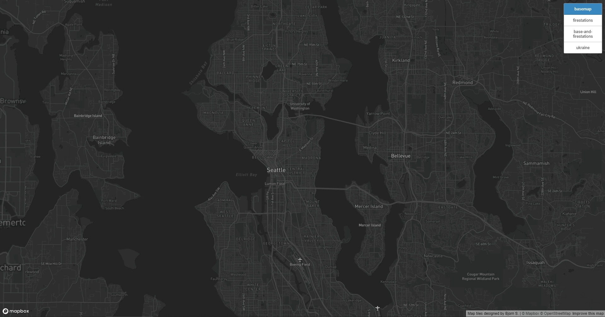
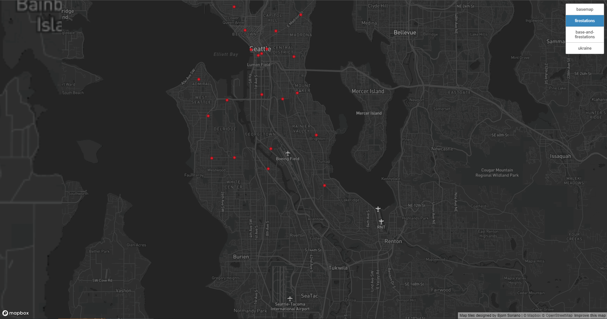
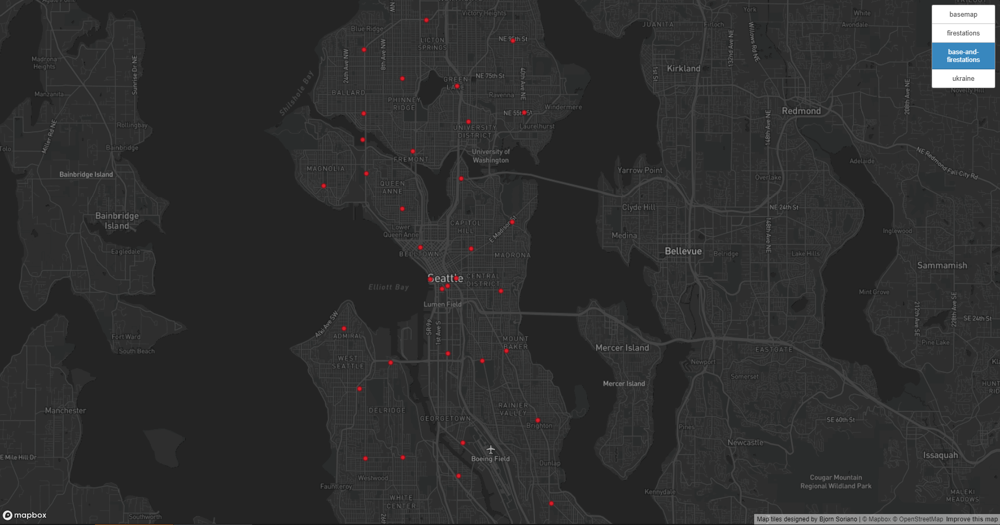
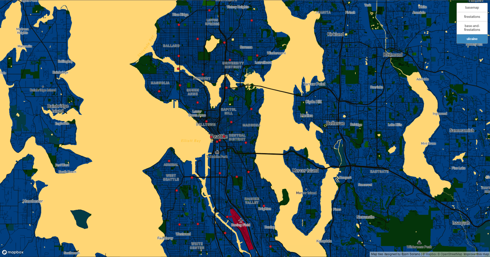

# GEOG 458 Lab 4 - Map Tile Generation
### Bjorn Soriano | 05/06/2022 

[Access the map](https://soriabjo.github.io/Map-Generation/)

## Map 1: Basemap (Updated)

Map centered on the city of Seattle. Updated the basemap by changing the base colors (water, city names) as well as the fonts from the traditional Mapbox dark style that is provided. Zoom levels used were a mimimum of 1, maximum of 14

## Map 2: Firestations

Map centered on the city of Seattle. Pulled data from Seattle Open Data Portal using locations of firestations in the city of Seattle. Zoom levels were a minimum of 1, maximum of 14. Check out the datasource from the [Washington State Department of Health here.](https://doh.wa.gov/data-statistical-reports/data-systems/geographic-information-system/downloadable-data-sets)

## Map 3: Modified Basemap + Firestations Dataset

Map centered on city of Seattle. Combination of the basemap from map 1 and the firestations dataset. Zoom levels were minimum of 1, maximum of 14

## Map 4: Ukraine Theme

Map centered on the city of Seattle. As my group's research proposal is focused on Ukraine, I designed a custom map style in Mapbox using Ukraine's flag official color codes. The theme contains the firestation locations in Seattle as well. Zoom levels were minimum of 1, maximum of 14

## Credits

- Special thanks to Bo Zhao for this assigment. Check out the assignment's instructions [here](https://github.com/jakobzhao/geog458/tree/master/labs/lab04)

- [Mapbox](https://studio.mapbox.com/)
